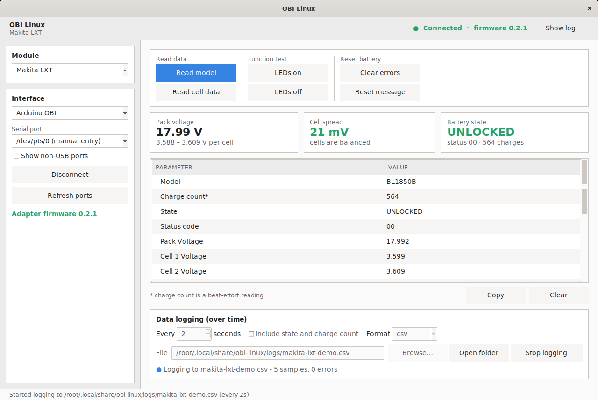
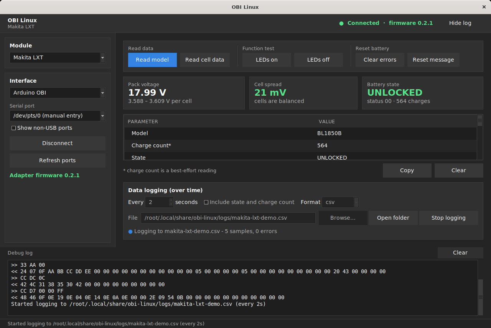

# OBI Linux

**OBI Linux** is a Linux port of [Open Battery Information][upstream] (OBI) —
tools and information about various batteries in order to aid repair.

It is very common for manufacturers to lock the BMS when a fault is detected
to protect the device and the user. Very important feature! So when is it a
problem? Well, there is always a chance for false triggering of this
protection, or the fault could have been temporary or even repaired. In that
case it would be wasteful to throw out a perfectly good BMS just because its
software says it is faulty.

This is the problem we would like to solve!



<details>
<summary>Dark mode (follows the desktop preference)</summary>



</details>

> **About this fork.** Upstream ships Windows and macOS builds. This fork adds
> first-class support for **Pop!_OS, Ubuntu, Linux Mint and Debian**, adds
> **logging a battery over time** to both the app and a new headless CLI, and
> rebuilds the interface to look like a current desktop application - including
> a dark mode that follows the system setting.
> See **[docs/LINUX.md](docs/LINUX.md)** for the full Linux guide.

[upstream]: https://github.com/mnh-jansson/open-battery-information

---

## Quick start

### 1. Flash the adapter

Follow [`ArduinoOBI/README.md`](ArduinoOBI/README.md). An Arduino Uno/Nano or
an ESP32-C3 plus a few resistors is all the hardware you need.

### 2. Install OBI Linux

```bash
tar -xzf obi-linux-x86_64.tar.gz
cd obi-linux-x86_64
sudo ./install.sh
```

The installer puts `obi-linux` (desktop app) and `obi-log` (command line
logger) in `/usr/local/bin`, adds a menu entry, and installs a udev rule so
the adapter works without `sudo`. Log out and back in once, then launch **OBI
Linux** from your application menu.

Prefer running from source, or on another platform? See
[docs/LINUX.md](docs/LINUX.md#install); Windows `.exe` and macOS `.dmg` builds
are attached to tagged releases as well.

### 3. Read a battery

Choose the **Makita LXT** module and the **Arduino OBI** interface in the
sidebar, pick the port, press **Connect**, then **Read model** and **Read cell
data**.

---

## Logging a battery over time

New in this fork. Voltages, cell delta and temperatures are appended to a CSV
(or JSON Lines) file at a fixed interval, so you can watch a pack drain, warm
up, or drift apart.

**In the app:** the *Data logging (over time)* panel under the readings table.
Set an interval, press **Start logging**. It runs on a background thread and
flushes every row to disk, so you can keep using the app while it records.

**From the terminal:**

```bash
obi-log --list-ports                     # what is connected?
obi-log --once                           # a single reading
obi-log --interval 60 --duration 8h      # log for eight hours
obi-log --interval 30 --out ~/pack1.csv --include-status --append
```

**Unattended:** a systemd user service template is included in
[`linux/obi-log.service`](linux/obi-log.service).

Every row carries a timestamp, the elapsed time, the pack and cell voltages,
the cell delta and the temperatures — plus an `error` column, so a failed
sample shows up as a visible gap rather than disappearing. Columns are
documented in [docs/LINUX.md](docs/LINUX.md#what-ends-up-in-the-file).

---

## No hardware? Try the simulator

```bash
cd OpenBatteryInformation
python3 tools/fake_adapter.py --drain 5     # prints a /dev/pts/N path
OBI_EXTRA_PORTS=/dev/pts/5 python3 main.py  # the app can now talk to it
```

It emulates an adapter with a slowly draining pack, including the locked,
faulty and F0513 variants — handy for trying the logger or developing new
modules.

---

## Supported batteries

- Makita LXT, 5-cell packs: standard and F0513 (diagnostics-only) command sets

Modules and interfaces are loaded dynamically from
`OpenBatteryInformation/modules/` and `OpenBatteryInformation/interfaces/`, so
adding a new battery family means adding one file. The protocol and decoding
live in `OpenBatteryInformation/core/`, free of any GUI dependency, and are
covered by tests that need no hardware (`make test`).

---

## What this fork changes

- Interface rebuilt in the visual language current Linux desktops use: a header
  bar, cards with hairline borders instead of 3D group boxes, an 8 px spacing
  grid, the system font, one accented primary action, headline readings, and a
  collapsible protocol log
- Dark mode that follows `org.gnome.desktop.interface color-scheme`, plus
  desktop text scaling; both overridable with `OBI_THEME` and `OBI_SCALING`
- Linux packaging: PyInstaller specs, CI, `.desktop` entry, icon, installer
- udev rules for Arduino/FTDI/CH340/CP210x/PL2303/ESP32, including telling
  ModemManager to leave the adapter alone
- Serial port picker that hides built-in UARTs, prefers stable
  `/dev/serial/by-id` paths, and explains permission problems instead of
  failing silently
- Time-series logging: in-app panel, `obi-log` CLI, systemd unit
- Longer default serial timeout and a boot wait, so the first read after
  connecting no longer fails on the slower command paths
- Automatic reconnect when the adapter re-enumerates during a long log
- A pty-based adapter simulator, and a test suite that runs without hardware
- Resource paths resolved from the executable, so launching from a menu entry
  works

---

## Credits and acknowledgements

OBI Linux builds on [Open Battery Information][upstream] by Martin Jansson.
All battery protocol reverse engineering and the original application
architecture are his work. If you find OBI Linux useful, please consider
supporting the upstream author:

- Contact the upstream author: openbatteryinformation@gmail.com
- [Buy the upstream author a coffee](https://www.buymeacoffee.com/mnhjansson)

[](https://www.buymeacoffee.com/mnhjansson)

## License

MIT. The upstream copyright is preserved in [`LICENSE.md`](LICENSE.md)
alongside the copyright for the Linux fork changes.

## Safety

Working on battery packs means working with stored energy. Shorting a pack,
puncturing a cell or reviving a pack that is genuinely faulty can cause fire.
Clearing an error code does not repair the fault that set it — diagnose first,
and if the pack is damaged, recycle it.
